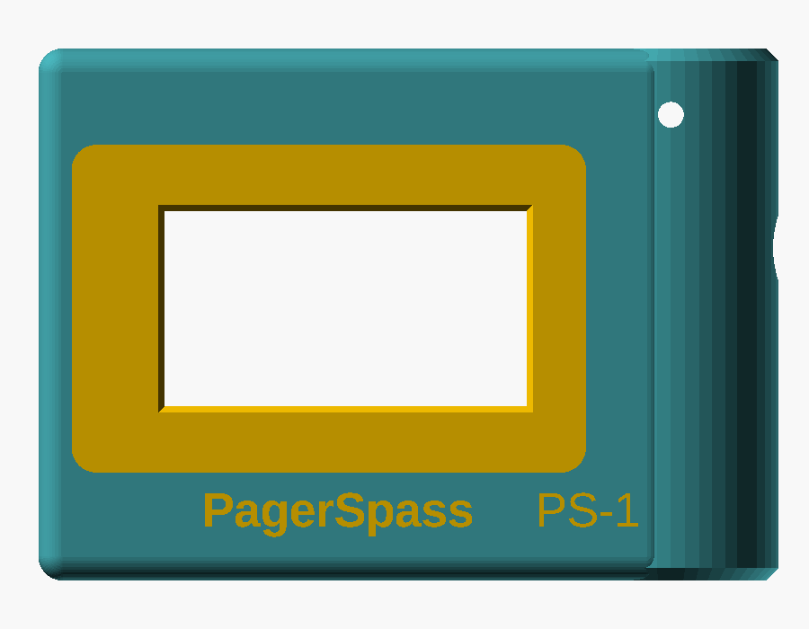

# PagerSpass Pager

Ein echter kleiner Funkmelder zum Selberbauen für **PagerSpass**. Optisch angelehnt an den Swissphone s.QUAD X35.

Du bist in einer Runde am PC, es kommt ein Alarm – und der Melder auf dem Tisch piept, die rote LED blinkt und auf dem Display steht die Meldung. Genau wie im Spiel, nur in echt.

## Was kann er?

- Alarmierung mit Ton, roter LED und Anzeige wie im Spiel (Datum, Uhrzeit, Adresse, Text)
- Quittieren per Tastendruck – im Spiel ist der Alarm dann auch quittiert
- Anmeldung mit dem normalen PagerSpass Konto, kein Premium nötig
- Nachrichtenspeicher (die letzten 20)
- Melder-Menü: Lautstärke, Alarmton, Helligkeit, Stumm, Info …
- Einrichtung komplett über das Handy, kein Programmieren nötig
- Akku mit USB-C Laden

## Einrichtung in Kurz

1. Einschalten → „Willkommen zu PagerSpass Pager“
2. Mit dem Handy ins WLAN **Pager-XXXX** gehen, die Einrichtungsseite geht von selbst auf
3. Eigenes WLAN eintragen
4. PagerSpass Benutzername + Passwort eintragen (wie im Spiel)
5. Fertig – der Pager wartet jetzt auf eine Runde

## Teile

ESP32-C3 SuperMini, 2" ST7789 Display, 4 Taster, Mini-Lautsprecher, rote LED, LiPo + TP4056. Zusammen ca. **15–20 €**. Genaue Liste: [docs/TEILELISTE.md](docs/TEILELISTE.md)

## Ordner

| Ordner | Inhalt |
|---|---|
| `firmware/` | Code für den ESP32-C3 (PlatformIO) |
| `case/` | Gehäuse, OpenSCAD-Datei + fertige STL |
| `hardware/` | Schaltplan |
| `tools/testserver/` | Testserver zum Ausprobieren ohne Spiel |

Braucht PagerSpass mit Pager-Anschluss (`/hub/pager`).
| `docs/` | Anleitung, Bedienung, Protokoll |

## Doku

- [Teileliste](docs/TEILELISTE.md)
- [Bauanleitung](docs/BAUANLEITUNG.md)
- [Bedienung](docs/BEDIENUNG.md)
- [Protokoll (für Server/Spiel)](docs/PROTOKOLL.md)

## Lizenz

MIT, siehe [LICENSE](LICENSE). Nachbauen, verändern, verbessern – gerne! Pull Requests sind willkommen.
