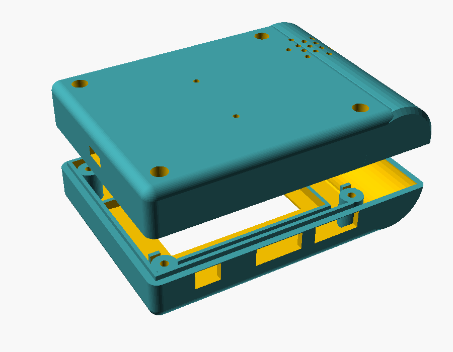
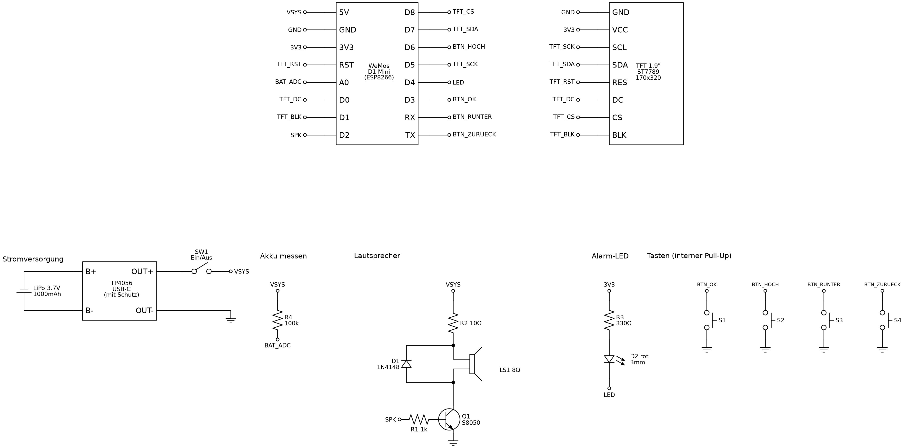

# Bauanleitung

Dauer: ungefähr ein Nachmittag (+ Druckzeit).

## 1. Gehäuse drucken

Die fertigen Dateien liegen in `case/stl/`:

| Datei | Was | Ausrichtung |
|---|---|---|
| `pager_front.stl` | Vorderteil mit Display-Fenster | Vorderseite aufs Bett (liegt schon richtig) |
| `pager_back.stl` | Rückteil mit Lautsprecher-Löchern | Rückseite aufs Bett (liegt schon richtig) |
| `pager_buttons.stl` | 3 Tasten oben + 1 Seitentaste | liegt richtig |
| `pager_clip.stl` | Gürtelclip | liegt richtig, **nicht drehen** (sonst bricht er) |

Einstellungen die bei mir gut gingen:

- PLA oder PETG (Clip besser PETG)
- 0,2 mm Schichthöhe, 3 Wände, 20 % Infill
- Stützstrukturen: nur „nur vom Druckbett“ für Vorder- und Rückteil (USB-Löcher, Seitentaste)
- Schwarz oder Dunkelgrau sieht am meisten nach echtem Melder aus

Wer was ändern will (anderes Display, dickerer Akku …): `case/pager.scad` in OpenSCAD öffnen, oben stehen alle Maße. Danach z. B.

```
openscad -D 'part="front"' -o stl/pager_front.stl pager.scad
```



> **Wichtig:** Die 1.9" Display-Module sind nicht alle gleich groß. Miss deins nach (Platine und sichtbare Fläche) und trag die Maße in `disp_pcb`, `disp_win` und `disp_win_off` ein, bevor du druckst. Eingestellt sind 57,8 x 33,4 mm Platine und 43,5 x 23,5 mm Fenster.

## 2. Schaltplan



### Verdrahtung

| D1 Mini | geht an |
|---|---|
| 5V | VSYS (Schiebeschalter → TP4056 OUT+) |
| GND | GND von allem |
| 3V3 | Display VCC, LED (über R3) |
| RST | Display RES |
| A0 | über R4 100 kΩ an VSYS (Akku messen) |
| D0 | Display DC |
| D1 | Display BLK |
| D2 | R1 1 kΩ → Basis Q1 (Lautsprecher) |
| D3 | Taster OK (Seite) → GND |
| D4 | LED: 3V3 → R3 330 Ω → LED → D4 |
| D5 | Display SCL |
| D6 | Taster HOCH → GND |
| D7 | Display SDA |
| D8 | Display CS |
| RX | Taster RUNTER → GND |
| TX | Taster ZURÜCK → GND |

Jeder Pin vom D1 Mini ist belegt, auch RX und TX. Darum gibt der Pager am echten Gerät nichts über USB aus (im Simulator schon).

Die Taster brauchen keine Widerstände, das macht der ESP intern (Pull-Up).

Die LED hängt „andersrum“ (von 3V3 zum Pin), weil D4 beim Starten HIGH sein muss. Die kleine blaue LED auf dem D1 Mini blinkt deshalb mit, das ist normal.

Lautsprecher: VSYS → R2 10 Ω → Lautsprecher → Kollektor Q1, Emitter an GND. Die 1N4148 parallel zum Lautsprecher, Strich (Kathode) Richtung VSYS.

## 3. Löten

Reihenfolge wie ich es gemacht habe:

1. **Tastenplatine:** Von der 5x7 cm Lochrasterplatine an der langen Seite einen Streifen abschneiden, **4 Löcher breit** (ca. 10 mm). Mit dem Cutter mehrmals entlang einer Lochreihe ritzen und abbrechen, Kante kurz anschleifen. Dann auf **60 mm** Länge kürzen. Drei Taster drauf, Mitte von links (von vorne gesehen): 16 mm, 38 mm, 57 mm. Das sind ZURÜCK, HOCH, RUNTER. Eine gemeinsame GND-Leitung, jeder Taster ein eigenes Kabel.
2. **Display:** 8 Kabel an das Display löten (ca. 8 cm lang). Keine Stiftleiste, die ist zu hoch!
3. **Lautsprecher-Teil:** Q1, R1, R2 und D1 fliegend oder auf einem kleinen Rest von der Lochrasterplatine, gut mit Schrumpfschlauch isolieren.
4. **LED:** R3 direkt an das Beinchen löten, Schrumpfschlauch drüber.
5. **Seitentaste (OK):** einzelner Taster, zwei Kabel.
6. **Akku messen:** R4 zwischen VSYS und A0.
7. **Strom:** Akku an B+/B- vom TP4056. OUT+ an den Schiebeschalter, vom Schalter an 5V vom D1 Mini. OUT- an GND.

> Akku-Kabel **nie** kurzschließen. Erst alles andere fertig machen, Akku zum Schluss anlöten.

> **Wichtig:** Wenn der D1 Mini per USB am Rechner hängt, muss der Schiebeschalter auf **AUS** stehen. Sonst drückt der USB 5 V direkt in den Akku.

## 4. Firmware flashen

1. [VS Code](https://code.visualstudio.com/) + PlatformIO Erweiterung installieren
2. Ordner `firmware/` öffnen
3. **Schiebeschalter auf AUS**, dann den D1 Mini per USB-C an den Rechner
4. Unten die Umgebung **`env:pager`** wählen und auf den Pfeil (Upload) klicken

Wird der D1 Mini nicht erkannt: Der CH340 Treiber fehlt. Beim Mac ist er ab macOS 11 dabei, sonst von der Seite vom Hersteller (WCH) laden. Und ein USB-Kabel nehmen, das auch Daten kann (manche können nur Laden).

Über die Konsole geht es auch:

```
cd firmware
pio run -e pager -t upload
```

> Beim Einschalten **nicht OK gedrückt halten**. OK hängt an D3, und damit startet der D1 Mini im Flash-Modus statt normal.

## 5. Zusammenbauen

1. Display ins Vorderteil legen, Glas Richtung Fenster. Es sitzt im Rahmen, mit ein paar Punkten Heißkleber am Rand fixieren.
2. Tastenkappen von innen in die Löcher oben stecken, dann die Tastenplatine in die zwei Halter schieben (bisschen Heißkleber).
3. LED von innen in das kleine Loch rechts oben (Walze) drücken, Kleber drauf.
4. Seitentaste: Kappe in die halbe Öffnung an der Walze legen, Taster dahinter mit Heißkleber fest.
5. Akku mit doppelseitigem Klebeband hinter das Display kleben.
6. Im Rückteil: Lautsprecher in den Ring kleben, D1 Mini und TP4056 zwischen die Führungen legen, USB-Buchsen in die Öffnungen unten. Mit Heißkleber fixieren.
7. Schiebeschalter in den Schlitz an der linken Seite kleben.
8. Kabel ordentlich legen, zuklappen, 4 Schrauben M2 x 10 von hinten.
9. Gürtelclip mit 2 Senkkopfschrauben hinten dran. Durch die Löcher im Clip kommt man mit dem Schraubenzieher an die Schrauben.

## 6. Erster Test ohne Spiel

Im Ordner `tools/testserver` ist ein kleiner Server der so tut als wäre er PagerSpass:

```
cd tools/testserver
pip install -r requirements.txt
python server.py
```

Bei der Einrichtung unter „Erweitert“ als Server `http://<IP von deinem PC>:8080` eintragen, Benutzername egal, Passwort `test`.

Dann im Terminal:

```
/start Stade
B3 Wohnhausbrand | Hauptstraße 5 | Rauch aus Dachstuhl
```

→ Pager sollte piepen. Mehr Befehle stehen beim Start im Terminal.

## Probleme

| Problem | Lösung |
|---|---|
| Display bleibt weiß/schwarz | Kabel SCL/SDA/DC/CS prüfen, BLK an D1? RES am RST vom D1 Mini? |
| Farben komisch/invertiert | Bei manchen Displays in `display.cpp` nach `tft.init` ein `tft.invertDisplay(false);` einfügen |
| Kein Ton | Q1 richtig rum? (E-B-C) R2 dran? |
| Pager startet immer neu | Akku leer oder Schalter wackelt |
| Pager startet nicht, Display bleibt dunkel | OK beim Einschalten gedrückt? Dann startet er im Flash-Modus |
| Akku zeigt „USB“ | R4 nicht angeschlossen |
| WLAN „Pager-XXXX“ taucht nicht auf | Alles zurücksetzen: HOCH + RUNTER beim Einschalten 5 s halten |
